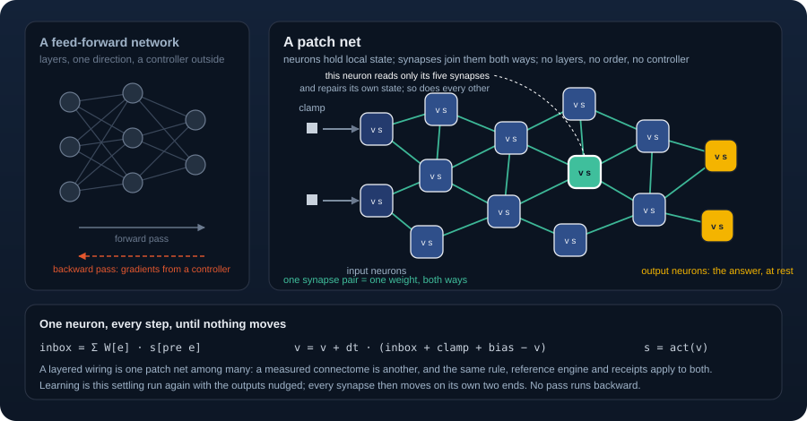

<p align="center">
  
</p>

# Cadence

**Small, stateful networks that read, repair, and learn locally.**

Cadence builds observer-like software patches: bounded local state, declared input
and output ports, readback, records, and feedback that repairs a discrepancy.
A patch net connects those patches with weighted seams. Use it to explore recurrent
inference, learning by equilibrium detuning, and memory that can correct its records.

## Install

Use Python 3.11 or later and Git. Install the source for the API documented here:

```bash
python -m venv .venv
source .venv/bin/activate
python -m pip install "cadence-net @ git+https://github.com/muellerberndt/cadence.git@main"
```

On Windows PowerShell, activate with `.venv\Scripts\Activate.ps1`.
The package name is `cadence-net`; the Python import is `cadence`. Only NumPy is
required. From a checkout, use `python -m pip install -e .`.
See [backends](docs/backends.md) for optional CPU and GPU acceleration.

## Remember, then correct

Copy this into Python or save it as `remember.py` and run `python remember.py`:

```python
import numpy as np
import cadence as cd

# Three key coordinates, two value coordinates, one independent memory per batch row.
memory = cd.FastSeams(np.arange(3), np.arange(3, 5), rule="delta")
key = np.array([[0., 1., 0.]])
memory.observe(key, np.array([[1., 0.]]))
print(memory.recall(key))
memory.observe(key, np.array([[0., 1.]]))
print(memory.recall(key))
```

Expected output:

```text
[[1. 0.]]
[[0. 1.]]
```

For a unit key `k`, the write is `M += outer(k, value - k @ M)`. A correct
prediction causes no change. Orthogonal keys retain their own values; overlapping
keys can interfere. This is an established delta-rule associative memory, with
explicit ports and stream resets. It needs no recurrent solve or offline training.

## Choose the operation

| Your task | Start with | Runnable guide |
|---|---|---|
| Infer a response when parts of a circuit influence each other | `Wiring` and `Settlement` | [Quickstart: a three-owner circuit](docs/quickstart.md) |
| Store observations and revise them as values change | `FastSeams(rule="delta")` | [Memory](docs/memory.md) |
| Learn reusable responses from labelled observations | `Learner` | [Quickstart: fit two labels](docs/quickstart.md#learn-a-response) |
| Carry recent activity or learn from delayed reward | `Trace`, `ActorCritic` | [Task recipes](docs/tasks.md), [reward](docs/reward.md) |

Settlement repeatedly repairs interacting state. A learner settles freely, then
nudges its output ports toward and away from a target and updates each seam from
its endpoint changes. It retains phase states and optimizer history without a
backward computation graph. The equilibrium-gradient interpretation requires
symmetric effective recurrent weights, converged phases, and a smooth stable
equilibrium branch. [Learning](docs/learning.md) gives the equations and limits.

## Examples with controls

Start with the [live composite brains](https://github.com/muellerberndt/cadence-examples#live-composite-brains):
teach a mouse a new task, disturb a drawing arm, or watch a forager revise its
memory. The web demos expose their supplied body rules, learned records, and
measured controls. The original tutorials remain available below.

| Example | What you can explore |
|---|---|
| [01 digits](https://github.com/muellerberndt/cadence-examples/tree/main/01_digits) | classification, validation selection, and an MLP comparison |
| [02 recall](https://github.com/muellerberndt/cadence-examples/tree/main/02_recall) | one-hot associative storage and a direct-read control |
| [03 Connect Four](https://github.com/muellerberndt/cadence-examples/tree/main/03_connect_four) | imitation of a search policy and playable inference |
| [04 Pong](https://github.com/muellerberndt/cadence-examples/tree/main/04_pong) | reward-weighted learning and a REINFORCE comparison |
| [05 changing memory](https://github.com/muellerberndt/cadence-examples/tree/main/05_memory) | record revision, a trained transformer, exact lookup, and key interference |
| [06 interventions](https://github.com/muellerberndt/cadence-examples/tree/main/06_interventions) | a supplied circuit under changed wiring and ablations, compared with an MLP, fixed unrolling, and Newton's method |

Changing memory shows where an explicit bounded store helps with long streams,
and where overlapping keys make it worse than the tested transformer. The circuit
example reuses a supplied rule without fitting an input/output surrogate;
conventional graph recurrence can reuse that rule too. Each tutorial records its
data, controls, cost, and source-bound results. These comparisons test specific
tasks and resources; they do not establish general superiority over transformers.

## Check your result

`Settlement.residual(drive, state)` checks the remaining fixed-point discrepancy.
`conformance` compares a trajectory with an owner-by-owner reference. A `Receipt`
can bind outcomes to sources and a caller-supplied arithmetic check. These checks
answer different questions; [the quickstart](docs/quickstart.md) shows the first
two, and [receipts](docs/receipts.md) explains reproducible comparisons.

[Quickstart](docs/quickstart.md) · [Concepts](docs/concepts.md) ·
[Biology-to-Cadence map](docs/biology.md) ·
[Learning](docs/learning.md) · [Memory](docs/memory.md) ·
[API](docs/api.md) · [All docs](docs/index.md)

Cadence grew from connectome and observer-patch experiments. Related methods include
[equilibrium propagation](https://arxiv.org/abs/1602.05179) and
[delta-rule linear transformers](https://arxiv.org/abs/2406.06484).

MIT licensed.

Compare predicted outcomes before acting with the tested
[deliberation pattern](docs/deliberation.md): independent imagined branches,
a learned evaluator, and feedback from real outcomes.
