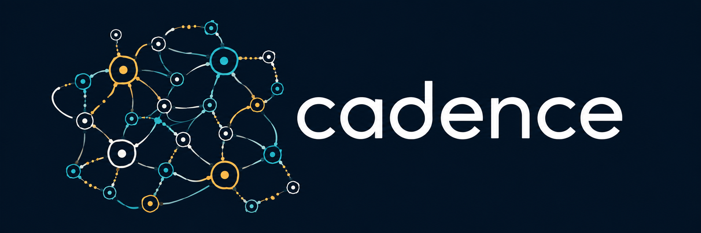

<p align="center">
  
</p>

# Cadence

[Website](https://floatingpragma.io/) · [Cadence page](https://floatingpragma.io/cadence/) · [Live brains](https://floatingpragma.io/cadence-examples/) · [Examples repository](https://github.com/muellerberndt/cadence-examples) · [PyPI](https://pypi.org/project/cadence-net/)

**Decentralized networks of neurons that learn through symmetry breaking, from an
ongoing stream of experience.**

Human brains do not learn by gradient descent and backpropagation, and they do not
freeze their weights after pretraining. Neither does Cadence. A Cadence brain is made of
cortices that settle together into equilibria, where a transformer stacks feedforward
layers with attention. Each synapse changes from the activity of its own two neurons, and
the same brain acts and learns throughout its life. Build a brain together with its
learning life: what it observes, remembers, predicts, wants and does.

## Why Cadence

- **No backpropagation.** Each synapse learns from its own two neurons and one broadcast
  error. No neuron reads a global gradient, and no computation graph is stored.
- **No training and inference steps.** There is one mode. Each `GenericBrain.step`
  takes in an observation and the previous action's outcome, updates memories and
  synapses, and chooses the next action. There is no switch between learning and use, no
  separate deployment model and no point at which learning must stop.
- **No frozen weights.** Learning happens during use. A brain keeps adapting to new
  observations, rewards and corrections for as long as it runs.
- **Short-term memory arises naturally.** Settled regions carry context across a delay
  and complete a partial reading, so thoughts linger in the brain.
- **Long-term memory arises naturally.** Salient and repeated facts are written into the
  records the current reading touches, and plasticity keeps them in persistent synapses.
  One stream, no replay ring.
- **A continuous stream of thought.** A Cadence brain does not run in shots or discrete
  invocations. It is one ongoing loop, and each observation and reward arrives while the
  brain is still thinking.
- **Imagined futures.** Small random drive breaks the symmetry of a settled state and
  pushes the brain toward nearby alternatives. The brain settles each imagined future in
  isolation, compares the recorded consequences and acts on the best one. Imagined
  outcomes never become witnessed facts.
- **Built like biology.** Neurons, synapses, cortices, a critic and an associative
  reward memory are the building blocks, and real connectomes load as plain data.

## How the brain works

**Observe → remember → predict → act or communicate → learn from the outcome.**

Thinking reads the current state; actual observations, rewards and corrections change
what is learned. The application controls when each event arrives. Keep the issued action
pending until its real outcome arrives; a clock tick alone is not new feedback. Start with
the [single-loop quickstart](docs/quickstart.md).

- **Local neural state:** neurons exchange activity over declared synapses; the settled
  regions reach a joint fixed point that completes a partial reading, carries context
  across a delay and holds the policy.
- **Records:** a mean-free reading passes through a fixed sparse expansion with
  winner-take-all inhibition; each active cell keeps a record of what followed; the
  prediction is the activity-weighted sum of the records the reading touches; the
  witnessed outcome is written into exactly those, at a slow rate for consequences and a
  fast rate for reward.
- **Local learning in the settled regions:** free and nudged phases and eligibility
  traces change synapses from their own two neurons' activity and one broadcast error,
  with no backward computation graph.
- **Prediction and goals:** imagined consequences are record reads; a supplied search
  over them and isolated imagined futures guide a choice.

These are observer-like, self-reading software patches: bounded local state, declared
ports, readback, records and feedback/repair, with checkable evidence. The
[experience guide](docs/experience.md) connects the functions and curriculum.
`GenericBrain` is the ready composition of settled regions: a recurrent policy, a critic
and an associative reward memory. The records cortex is `cd.Records`
([records](docs/memory.md#records)). Learned goals and language are not supplied.
Cadence does not claim to reproduce human learning or supply a pretrained chatbot.

## Install

Python 3.11+, with NumPy as the only required dependency:

```bash
python -m venv .venv
source .venv/bin/activate
python -m pip install "cadence-net @ git+https://github.com/muellerberndt/cadence.git@main"
```

On Windows activate with `.venv\Scripts\Activate.ps1`.
[Optional backends](docs/backends.md) support Numba, PyTorch and MLX.

## Examples

Four applications built on this loop, each with its page, its acceptance receipt and the
verifier that recomputes the receipt from the event logs, are in the
[examples gallery](https://github.com/muellerberndt/cadence-examples).

- **Arm** ([page](https://floatingpragma.io/cadence-examples/arm/),
  [receipt](https://github.com/muellerberndt/cadence-examples/blob/main/arm/receipt.json)):
  a two-link arm learns its own body from motor babbling, copies what a visitor draws
  through a search over the consequences it has recorded, adapts to a longer link without
  a reset and returns to its original body. The whole brain runs beside the arm.
- **World** ([page](https://floatingpragma.io/cadence-examples/world/),
  [receipt](https://github.com/muellerberndt/cadence-examples/blob/main/world/receipt.json)):
  in a 6 by 6 world seen one cell at a time, one life learns the consequences of its
  actions, remembers where it saw an object, corrects that memory when the object moves,
  holds a cue across a delay and grounds words in objects.
- **Connect Four** ([page](https://floatingpragma.io/cadence-examples/connect_four/),
  [receipt](https://github.com/muellerberndt/cadence-examples/blob/main/connect_four/receipt.json)):
  one life learns what a dropped stone does and which windows are completed lines from the
  games it plays, and searches over what it learned; a visitor plays against it while it
  keeps learning.
- **Artist** ([page](https://floatingpragma.io/cadence-examples/artist/),
  [receipt](https://github.com/muellerberndt/cadence-examples/blob/main/artist/receipt.json)):
  the arm holds a pen over a canvas, learns what its strokes leave and draws figures it has
  never seen, replanning from its own canvas after every stroke; a visitor draws a figure
  and watches it drawn.

Each learns from one stream with no replay ring: the world model is a records cortex and
the settled regions complete partial readings, carry context and hold the policy. The
gallery's comparison runners put an online MLP and an online transformer in the same
lives, with and without a replay ring; the receipts hold the numbers.

## Reference

[Experience](docs/experience.md) · [Quickstart](docs/quickstart.md) ·
[Continuous interaction](docs/continuous.md) · [Records](docs/memory.md#records) ·
[Write a cortex](docs/cortex.md) · [Compose a brain](docs/brain.md) ·
[Evolve a brain](docs/evolution.md) · [Local learning](docs/learning.md) ·
[Reward](docs/reward.md) · [API](docs/api.md) · [All docs](docs/index.md) ·
[Examples gallery](https://github.com/muellerberndt/cadence-examples)

Check equation residuals before claiming equilibrium. Measure task quality and
learning cost; local updates alone guarantee neither capability nor speed.
[Concepts and limits](docs/concepts.md). MIT licensed.
