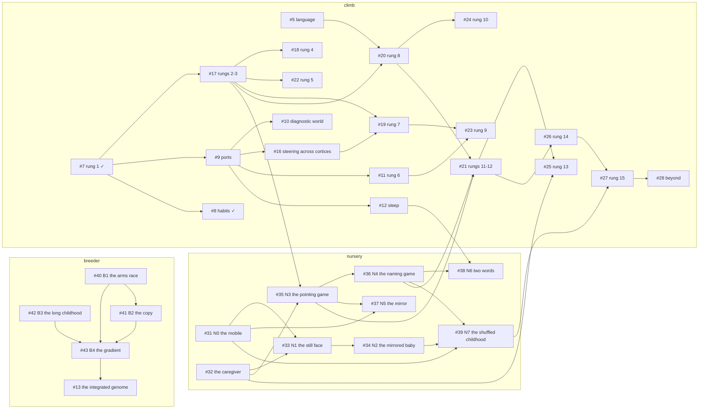

# The plan: every feature, its demo, and where it stands

> **Final goal.** A patch-net equilibrium brain that is more scalable, more capable and more efficient than a transformer, climbing the [metacognition ladder](METACOGNITION_LADDER.md) to a robot that acts and speaks among people.

This is the one list. The [ladder](METACOGNITION_LADDER.md) states the science of each step (what the steering patch reads and returns, the experiments, the control, the falsifier) in three tracks: the climb (what a brain earns), [the nursery](METACOGNITION_LADDER.md#the-nursery) (what the world supplies in one life) and [the breeder](METACOGNITION_LADDER.md#the-breeder) (what pays for a brain across lives). The GitHub issues carry the same acceptance line per step, and every dependency is recorded there as a "blocked by" relation and as a sub-issue; the demos live in the workspace's `demos/` folder and, once they run in the browser, in the [examples repository](https://github.com/muellerberndt/cadence-examples). This page is the index of all of it, kept current as steps are accepted.

## The principles, and what "un-designed" means in practice

The main hypothesis stays: a brain that settles in global equilibria. The building block stays as simple as possible, like in nature, and every part of the brain answers with a settled state of that one rule. Natural evolution is always preferred to design:

- A governor, a steering patch, a habit, a port: each is a patch of the same rule, settled, never a hand-written rule or a feed-forward add-on. The hand-written rule is the control on the page.
- Anything that looks designed (a threshold, a budget, a horizon, a port's band and width, a motor coding, a fitness price, the moment a readback opens) is a gene in a dict genome under `evolve` with `genes`, and the hand-set value is the control. Selection prunes what does not pay; every such outcome is kept, including the ones where the pruning goes against the designer.
- Within a life only the patch rule learns (the detuning contrast, the nudge, the adjoint); across lives the genome evolves.
- A fitness reads only what the genome cannot reweight (the room's gamed surprise is the exhibit).
- The caregiver is the environment, never a brain; scripting it breaks no principle. From rung 13 on, a brain takes its place and the script is the control.
- Development is a process the brain's own actions generate, never pretraining: one life, a caregiver in the loop, stages that open as earlier ones are mastered. It runs at high speed because nothing in it is tied to wall-clock time except the number of interactions and the settling cost per decision.

## The rule of acceptance

Every step is accepted by a demo. The page has the shared skeleton (the whole brain in the viewer, the world, the instrument strip, the plain-words account), a three-way switch (the step on; off, the brain below it; the hand-designed control) so the acceptance is visible on the page, and the person in the world (the mouse as the laser dot, the ventriloquist's hand, the hand that shuffles the cups, the caregiver's face and hand). The step is accepted when the demo works with the switch on and fails with it off. The page's layout: the playfield and the brain side by side at the same height, the rung selected on load, the laser or the drag as the only interaction, one small brain-selector line, four instrument tiles, everything else in the collapsed section.

## The list

Status: **✅ completed** (the demo was accepted: it works with the switch on and fails with it off, on the numbers in its report), **in progress**, **open**. "Where" is the demo's directory in the workspace's `demos/` folder, and the live page when it runs in the browser.

### The substrate (rung 0)

| step | feature | the demo | status | where |
| --- | --- | --- | --- | --- |
| [#3](https://github.com/muellerberndt/cadence/issues/3) | the shared core: belief inference and private imagination | the shell game | ✅ completed 2026-09-23 | `demos/shell-game/` |
| [#7](https://github.com/muellerberndt/cadence/issues/7) | one cortex that lives: the three signals, the governor | the room with the heater and the window (rung 1's first page) | ✅ completed 2026-09-23 | `demos/room/` |
| [#8](https://github.com/muellerberndt/cadence/issues/8) | habits as patches | a reaching arm learns its muscle memory | ✅ completed 2026-09-23 | `demos/arm/` |
| [#9](https://github.com/muellerberndt/cadence/issues/9) | cortices joined by ports (in the library as `record_ports`) | an eye and an ear watch one ball | ✅ completed for the eye in the dark; the ear through the port stays open | `demos/eye-and-ear/` |
| [#15](https://github.com/muellerberndt/cadence/issues/15) | instruments: the brain's signals on every page | the polygraph | open (the tiles and the strip exist on every page; the shared component and receipt schema do not) | |
| [#16](https://github.com/muellerberndt/cadence/issues/16) | the steering patch across cortices | the referee | open | |
| [#4](https://github.com/muellerberndt/cadence/issues/4) | the player: scene-dependent consequences, internal foresight | ghost balls | open | |
| [#5](https://github.com/muellerberndt/cadence/issues/5) | language: valid memory probabilities, relational depth | the bedtime story | open | |
| [#6](https://github.com/muellerberndt/cadence/issues/6) | Connect Four: learned transitions, cheaper skilled decisions | blindfold Connect Four | open | |
| [#10](https://github.com/muellerberndt/cadence/issues/10) | understanding: withheld combinations | the alien zoo | open | |
| [#12](https://github.com/muellerberndt/cadence/issues/12) | sleep across cortices | sleep on it | open | |
| [#13](https://github.com/muellerberndt/cadence/issues/13) | evolution: the integrated brain's genome, sizes that scale; the umbrella of the breeder | the breeder | open | |
| [#14](https://github.com/muellerberndt/cadence/issues/14) | the integrated brain on the flagship platforms | one brain, three windows | open | |

### The climb: the rungs

| rung | feature | the demo | status | where |
| --- | --- | --- | --- | --- |
| 1 · [#7](https://github.com/muellerberndt/cadence/issues/7) | noticing itself: a governor patch reads the brain's own surprise and returns the mode | the dozing cat | ✅ completed 2026-09-23; the fifth canonical example | `demos/dozing-cat/`, [live](https://floatingpragma.io/cadence-examples/dozing-cat/) |
| 2 · [#17](https://github.com/muellerberndt/cadence/issues/17) | weighing the senses: a steering patch sets each sense's gain inside the repair | the ventriloquist | ✅ completed 2026-09-23 | `demos/ventriloquist/` |
| 3 · [#17](https://github.com/muellerberndt/cadence/issues/17) | looking: the steering patch moves where a sense samples, under a sensing cost | the lighthouse keeper | in progress | `demos/lighthouse-keeper/` |
| 4 · [#18](https://github.com/muellerberndt/cadence/issues/18) | the tiger: capture within one decision, habituation on repetition without consequence | the night nursery | open (started 2026-09-24, paused; one step at a time) | `demos/night-nursery/` |
| 5 · [#22](https://github.com/muellerberndt/cadence/issues/22) | curiosity: the steering patch's own cost prefers falling, consequential surprise | the toy box | open | |
| 6 · [#11](https://github.com/muellerberndt/cadence/issues/11) | how long to think | the chess clock | open | |
| 7 · [#19](https://github.com/muellerberndt/cadence/issues/19) | knowing what it does not know | phone a friend | open | |
| 8 · [#20](https://github.com/muellerberndt/cadence/issues/20) | the self-model: the brain reports its own gaze, the grounded report as language; the mirror is its developmental task | the sports commentator | open | |
| 9 · [#23](https://github.com/muellerberndt/cadence/issues/23) | the inner gaze: which futures to imagine | the heist | open | |
| 10 · [#24](https://github.com/muellerberndt/cadence/issues/24) | intention over intention | the DJ set | open | |
| 11 · [#21](https://github.com/muellerberndt/cadence/issues/21) | another observer; its precursor is the nursery's joint attention | the magician | open | |
| 12 · [#21](https://github.com/muellerberndt/cadence/issues/21) | dialogue, in the nursery's words | twenty questions | open | |
| 13 · [#25](https://github.com/muellerberndt/cadence/issues/25) | teaching; the scripted caregiver is the control | the driving instructor | open | |
| 14 · [#26](https://github.com/muellerberndt/cadence/issues/26) | a body among things | fetch | open | |
| 15 · [#27](https://github.com/muellerberndt/cadence/issues/27) | the humanoid that acts and speaks among people, raised in the nursery | the kitchen helper | open | |
| 16 · [#28](https://github.com/muellerberndt/cadence/issues/28) | beyond: development, collectives, deep dialogue | the parliament | open | |

### The nursery: one brain, one life, in nature's order

The umbrella is [#30](https://github.com/muellerberndt/cadence/issues/30); the caregiver [#32](https://github.com/muellerberndt/cadence/issues/32) is the environment object every stage uses. The [protocol](https://github.com/muellerberndt/cadence/blob/main/docs/METACOGNITION_LADDER.md#the-nursery) states each stage's measure, control and falsifier.

| stage | feature | the demo | status | where |
| --- | --- | --- | --- | --- |
| N0 · [#31](https://github.com/muellerberndt/cadence/issues/31) | the ecological self: the self split of the residual, live against delayed, the push test | the mobile | in progress (the experiment; the page is work in progress) | `demos/nursery/` |
| · [#32](https://github.com/muellerberndt/cadence/issues/32) | the caregiver: feeds, mirrors, responds, looks, points, names | the hand (on every nursery page) | in progress (the push; the rest is work in progress) | `demos/nursery/` |
| N1 · [#33](https://github.com/muellerberndt/cadence/issues/33) | the contingent other: turn-taking, the still face | the still face | open | |
| N2 · [#34](https://github.com/muellerberndt/cadence/issues/34) | imitation learned from being imitated | the mirrored baby | open | |
| N3 · [#35](https://github.com/muellerberndt/cadence/issues/35) | joint attention: gaze following, pointing | the pointing game | open | |
| N4 · [#36](https://github.com/muellerberndt/cadence/issues/36) | first words under joint attention, Baldwin's test | the naming game | open | |
| N5 · [#37](https://github.com/muellerberndt/cadence/issues/37) | the conceptual self: the mark test | the mirror | open | |
| N6 · [#38](https://github.com/muellerberndt/cadence/issues/38) | grammar: two words, the night | two words | open | |
| N7 · [#39](https://github.com/muellerberndt/cadence/issues/39) | the order experiment: nature's order, shuffled, born-open, no womb; the clock | the shuffled childhood | open | |

### The breeder: what pays for a brain across lives

Under [#13](https://github.com/muellerberndt/cadence/issues/13). Three evolving worlds ran the selection experiment and removed brains every time; these four say why, and what changes it.

| experiment | feature | the demo | status | where |
| --- | --- | --- | --- | --- |
| B1 · [#40](https://github.com/muellerberndt/cadence/issues/40) | the Red Queen: co-evolving populations against frozen opponents | the arms race | open | |
| B2 · [#41](https://github.com/muellerberndt/cadence/issues/41) | the duplication mutation: a copied cortex that reads cortex | the copy | open | |
| B3 · [#42](https://github.com/muellerberndt/cadence/issues/42) | provisioning as a gene: the long childhood | the long childhood | open | |
| B4 · [#43](https://github.com/muellerberndt/cadence/issues/43) | the recapitulation check: the human gradient as the control | the gradient | open | |

## Dependencies, and what runs in parallel

Every arrow below is a "blocked by" relation on GitHub; the tracker shows what is open to start. The three tracks share only a few edges: the gaze of rung 3 feeds joint attention, sleep feeds the nursery's grammar, joint attention and first words feed rungs 11 and 12, the caregiver is rung 13's control, and the clock evolved by the breeder is tested by the nursery's order experiment.

**Open to start with nothing new:** the mobile ([#31](https://github.com/muellerberndt/cadence/issues/31)), the caregiver ([#32](https://github.com/muellerberndt/cadence/issues/32)), the arms race ([#40](https://github.com/muellerberndt/cadence/issues/40)), the long childhood ([#42](https://github.com/muellerberndt/cadence/issues/42)), the polygraph ([#15](https://github.com/muellerberndt/cadence/issues/15)), the rung-0 work of [#4](https://github.com/muellerberndt/cadence/issues/4), [#5](https://github.com/muellerberndt/cadence/issues/5), [#6](https://github.com/muellerberndt/cadence/issues/6), [#10](https://github.com/muellerberndt/cadence/issues/10) and [#12](https://github.com/muellerberndt/cadence/issues/12), and the climb's next rungs on the accepted demos below them: the lighthouse keeper ([#17](https://github.com/muellerberndt/cadence/issues/17)) and the night nursery ([#18](https://github.com/muellerberndt/cadence/issues/18)). **Next in line once those land:** the still face ([#33](https://github.com/muellerberndt/cadence/issues/33)) after the mobile and the caregiver; the pointing game ([#35](https://github.com/muellerberndt/cadence/issues/35)) after the lighthouse keeper; the copy ([#41](https://github.com/muellerberndt/cadence/issues/41)) after the arms race.

## The order of work

The three tracks run side by side. In the climb the rungs are climbed in order, and a rung's demo is built on the accepted demos below it: the lighthouse keeper on the ventriloquist's steering patch (the gain becomes a gaze), the night nursery on the cat's governor and the ventriloquist's gains, the toy box on the nursery. In the nursery the stages are built in nature's order, each on the accepted stage below it, and the order experiment runs when the first five stand. In the breeder the arms race and the long childhood start at once on Patch World, the copy is built beside them and measured in the arms race, and the gradient reads their chronicles. A substrate demo is built when a rung needs it: the polygraph as the pages multiply, ghost balls for the Atari form of rung 3, the alien zoo for rung 12 and for the nursery's two words, blindfold Connect Four and the chess clock together. Every accepted demo also asks what the library should carry, and the library releases follow those asks (0.14.0 carried the belief patch's gains, readback and admitted step from the first three).

## What each document is

- This page: the list of features, demos and status, with the dependency graph.
- [The ladder](METACOGNITION_LADDER.md): the science of each rung, of each nursery stage and of each breeder experiment.
- The issues: one acceptance line per step, the discussion, the labels `ladder:*`, `nursery` and `breeder`, the milestones, and the "blocked by" relations.
- The manifesto in the flagship folder: the mission and the design contract; the flagship's own plan file governs the paper and its evidence.
- The `demos/` folder: the code, the reports, the receipts, the pages; the workspace plan `plan/CADENCE_NURSERY_2026-09-24.md` carries the nursery's protocol and the breeder's campaign in full.
