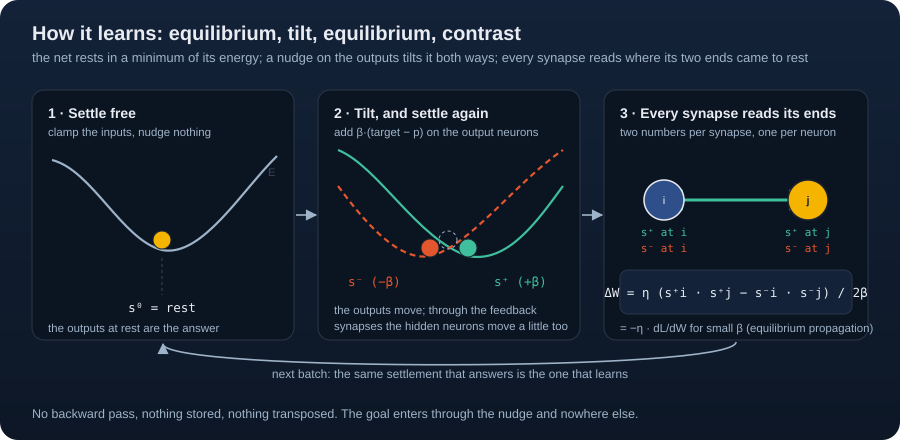

# Cadence for machine-learning people

This page says what Cadence is in the terms you use, which of its brains
corresponds to which model you know, where the learning signal comes from in each,
what the arrays look like, and what the words mean. Read it once; then the
[quickstarts](quickstart.md) and [build your own brain](build.md) are short.

## The picture

A Cadence brain is a set of patches joined by ports. A patch holds a bounded local
state (the potentials of a group of neurons, or one context vector), reads its inputs
through ports, and repairs its state until it agrees with what its ports hold and
with its weights. The answer is the settled state. Learning perturbs that state
toward an outcome and moves the weights on the difference between the perturbed and
the free state, locally, so there is no backward pass over a computation graph.
Beside the slow weights a patch can hold a record store: a fixed sparse code of the
reading addresses a table that takes an outcome in one write and reads it back at
the same reading, so a fact is kept without a gradient. A night of sleep moves what
the store holds into the slow weights.

The library is NumPy. Nothing in it is a layer, an optimizer or an autograd tape.
There are four kinds of brains.

## The four brains against models you know

| Cadence | The nearest familiar model | What is different |
| --- | --- | --- |
| The settling brain (`Genome`, `develop`, `Brain`, `Learner`) | A continuous Hopfield or energy-based recurrent network trained by [equilibrium propagation](https://arxiv.org/abs/1602.05179): rate neurons relax to a fixed point; the gradient is the contrast of a free and a nudged fixed point. | Any wiring, including a measured connectome. Synapse pairs share one weight. A [certificate](certificate.md) says when settling is a contraction and how far the answer is from the equilibrium. Reward learning through eligibility traces and one broadcast prediction error. |
| The temporal patch (`TemporalPatchNet`) | A tanh RNN, `h[t] = A tanh(h[t-1]) + B u[t]`, `y[t] = C tanh(h[t])`. | Trained by two detuned solves of the whole path's energy and their contrast, with the solves checked for symmetry, instead of backpropagation through time. The same contrast on the input ports, with weights frozen, is planning through the learned model. Chosen responses can be protected by projecting later updates ([orthogonal weight modification](https://www.nature.com/articles/s42256-019-0080-x)). |
| The record patch (`RecordPatchNet`) | A gated linear RNN with per-channel retention (a minimal GRU or a linear recurrent unit) plus a memory of the kind [Marr](https://doi.org/10.1113/jphysiol.1969.sp008820) and [Albus](https://doi.org/10.1016/0025-5564%2871%2990051-4) proposed for the cerebellum: a fixed random expansion, the `active` strongest cells kept, one [delta-rule](https://arxiv.org/abs/2406.06484) table read through them. | The store is inside the patch and takes an outcome in one write with no gradient; readings generalise by the overlap of their codes. `sleep` teaches the slow weights the store's own completions with the data gone, and rewrites the store at dawn. Categorical ports end in a softmax per group. |
| The belief patch (`BeliefPatch`) | A recurrent state-space world model: a transition under the executed action, evidence assimilated into the belief, imagination as an open-loop rollout ([Ha and Schmidhuber](https://arxiv.org/abs/1803.10122), [Dreamer](https://arxiv.org/abs/1912.01603)). | The evidence repairs the belief by a few iterations of one nonlinear map that also reads the record store; imagination is the transition alone and consumes no observation; the [imagination loss](belief.md#training-the-transition-the-imagination-loss) makes the transition carry the belief instead of leaning on the next frame. |

Compositions: `RecordPatchStack` puts two record patches in depth, `JointRecordPatches`
settles several as one equilibrium through declared ports, `StructuredPort` reads a grid
through a tied local kernel (a convolution at the port) and `evolve` mutates and selects
genomes across lives.

## Where the learning signal comes from

This is the question a machine-learning reader asks first, and the answer differs by
brain.

- **The settling brain and the temporal patch use no backward pass.** The free
  settle is the answer. A second settle with the outputs nudged by `beta` toward the
  target (and, centered, a third nudged away) gives every synapse the product of its
  own two neurons in each phase; the difference over `2 beta` is the update. On a
  smooth stable equilibrium with symmetric effective weights that contrast tends to
  the loss gradient as `beta` tends to zero ([learning](learning.md#5-why-the-contrast-is-a-gradient)).
  The temporal patch does the same on a whole path: it solves the path's energy plus
  and minus `beta` times the loss by damped Newton steps and takes the contrast of the
  parameter derivatives ([temporal learning](temporal.md#energy-and-update)).
- **The record patch and the belief patch train their slow weights by an adjoint
  scan** over the chunk they observed: one forward scan, one backward scan, the
  ordinary gradient of the slow readout's loss. The record store is a port value
  added to the readout and never receives a gradient; it is written by the delta
  rule after the scan with whatever the slow readout got wrong. For the record patch
  the energy is quadratic, and `detune` shows that the contrast of its two detuned
  equilibria equals the adjoint ([record patch](record-patch.md#detuning-as-the-acceptance-check)).
- **Records learn by one write.** A read is the code times the table; a write moves
  the records of the active cells by the error at that reading and touches nothing
  else. Two readings share records exactly as far as their codes overlap.
- **Reward** enters the settling brain as a broadcast prediction error gating every
  synapse's eligibility trace, a three-factor rule ([reward](reward.md)).
- **Backtracking** (`observe(..., backtrack=True)`) accepts a parameter step only
  after a target-free replay from the original boundary lowers the loss, halving the
  rate up to sixteen times. It replaces a learning-rate schedule.

## Compared with a backprop network

| | A network trained by backprop | A Cadence brain |
| --- | --- | --- |
| Reading an answer | Evaluate the layers | Settle to a fixed point, or run the causal scan, with a residual check |
| State between inputs | A cache or a separate memory | A settled state, a carried context, a trace or a record store, each explicit |
| Credit | Reverse-mode differentiation | Free and nudged contrasts for the settling brain and the temporal patch; an adjoint scan of the slow half for the record and belief patches; delta-rule writes for records |
| Memory of one event | Needs a replay buffer or fine-tuning | One write into the store, read back at the same reading |
| Planning | A separate policy or a search | The same contrast on the action ports with the weights frozen; imagination under declared actions |
| Hardware | GPU tensors | NumPy float64 on the CPU; optional torch, MLX or Numba for the settling brain's graph transport; torch for the belief patch's slow half |

Networks trained by backprop can also be recurrent, online, model-based and
memory-using; the comparison is of update mechanisms. Cadence's claim is about what
one bounded patch rule can be made to do, and every example repository page carries
a receipt and a check for its numbers.

## Shapes

| Brain | Inputs | Targets | State between calls | Checkpoint |
| --- | --- | --- | --- | --- |
| Settling brain | a drive of shape `(batch, n)`, one column per neuron; put features on the input neurons | integer labels `(batch,)` for `Learner.step`, or a target pattern `(batch, n)` for the phase calls | `BrainState` per row; pass `warm=` to continue | `Learner.save` / `Learner.load`, one `.npz` |
| Temporal patch | `(batch, time, inputs)` | `(batch, time, outputs)` | the hidden boundary `(batch, hidden)`; `reset()` clears it | `save` / `load`, `snapshot` / `restore` |
| Record patch | `(batch, time, inputs)` | `(batch, time, outputs)`, one-hot per group for categorical ports | the context `(batch, hidden)` plus the record tables | `save` / `load`, `snapshot` / `restore` |
| Belief patch | observations `(batch, time, inputs)` and actions `(batch, time, actions)` | `(batch, time, outputs)` | the belief `(batch, belief)` plus the record tables | `save` / `load`, `snapshot` / `restore` |
| Records cortex | a reading `(inputs,)` or `(batch, inputs)` | a dict of field targets | the tables, the running mean and the counters | the configuration from `to_dict()` plus the arrays |

Batch rows are independent streams sharing parameters. `imagine` is private: it
changes no parameter, record, state or counter. `advance` carries context without
learning. `observe` learns and, for a record patch, writes.

## Glossary

- **Patch.** A bounded unit with local state, ports, readback and a repair rule: a
  group of neurons with their synapses, one temporal or record patch, or a belief.
- **Port.** A declared band of a patch's state that another patch, or the world,
  reads or drives. Populations of a connectome, the input and output ports of a path,
  a `Port` between record patches.
- **Settle, settling.** Repeating the neuron update until nothing moves: the forward
  pass of the settling brain.
- **Equilibrium.** The settled state under fixed inputs and weights. For a path, the
  causal recurrence, which satisfies its temporal equations with zero defect.
- **Residual.** The remaining error of the fixed-point equations at a state. Small
  movement per step is not a residual; the residual is the check.
- **Certificate.** The contraction bound that says settling has a unique equilibrium
  and how far the last step's movement leaves the state from it.
- **Free phase, nudged phase.** The settle under the inputs alone, and the settle
  with the outputs pulled toward (or away from) the target by `beta`.
- **Detuning, contrast.** Perturbing an equilibrium and reading the difference between
  the perturbed and the free state; the learning signal of the settling brain and the
  temporal patch, and the planning signal on input ports.
- **Beta.** The strength of the nudge. Smaller is closer to the gradient and weaker.
- **Centered.** Two nudged phases, plus and minus `beta`, and their contrast over
  `2 beta`; the default.
- **Adjoint scan.** The backward pass of the record and belief patches over one
  chunk; the ordinary gradient of the slow readout's loss.
- **Backtracking.** Accepting a parameter step only if a target-free replay lowers the
  loss; halving the rate until it does or giving up.
- **Reading.** The vector a record store codes: for the records cortex whatever the
  application assembles; for the record patch the input block and the context block.
- **Code, cells, active.** The fixed random expansion of a reading onto `cells` units,
  of which the `active` strongest keep their rectified drive; the sparse key of the store.
- **Record, table.** One row per cell in one table per predicted field; a read is the
  code times the table.
- **Write, record rate.** The delta-rule step into the active cells' rows at
  `record_rate`; rate one takes the outcome whole.
- **Slow weights, slow readout.** The patch's parameters and the readout `C h + c`
  without the record read.
- **Dream, sleep, dawn.** The store's completion of a cue from rest; teaching the slow
  weights those fixed completions with the data gone; rewriting the store afterwards so
  it holds only what the weights did not take.
- **Context.** The carried state of a record or temporal patch between moments.
- **Imagine.** A private continuation: the free path from a state, changing nothing.
- **Advance.** Carrying context through observed inputs without learning.
- **Readback.** The detached state, residuals, counters and revision of a patch, as
  observations an application can read; a patch can read another's readback through a port.
- **Genome, develop, region, cortex, projection.** The declaration of a settling brain's
  regions and projections; its deterministic layout into one connectome; a named
  population; a builder of a standard region; a declared bundle of synapses.
- **Connectome.** The synapse list of a settling brain: `pre`, `post`, `count`, `sign`,
  and named populations.
- **Efficacy, gain, bias.** The learned signed strength of a synapse, the fixed
  per-neuron scale, and the learned per-neuron offset.
- **Eligibility trace, dopamine, valence.** Per-synapse memory of recent contrasts; the
  broadcast prediction error that gates them; the object that centers and caps it.
- **Steering patch.** A patch of the same kind whose evidence is the readback of the
  rest of the brain and whose settled state sets their gains, gaze, goals or budgets.
  Its experiments are tracked in the repository's issues.
- **Receipt.** A JSON file binding a result to the sources that produced it, with a
  digest and a verifier.

## Reading the numbers

Every measured claim in this repository and in the examples names its task, its
held-out split, its controls and the receipt that recomputes it. A settled state can
be wrong; a zero residual says the model agrees with itself, not with the world. A
score with records is not a score of the slow weights: report both. Compare against
the simple control the task admits (the majority outcome, persistence, a linear
predictor, the search alone). [Task design](task-design.md) and
[common missteps](missteps.md) list the checks; [receipts](receipts.md) says how a
number is bound to its sources.

## Further reading

The library's own guides link the sources they build on:
[equilibrium propagation](https://arxiv.org/abs/1602.05179) and its
[centered estimator](https://arxiv.org/abs/2006.03824), the
[delta-rule fast-weight memory](https://arxiv.org/abs/2406.06484), the cerebellar
model of [Marr](https://doi.org/10.1113/jphysiol.1969.sp008820) and
[Albus](https://doi.org/10.1016/0025-5564%2871%2990051-4),
[complementary learning systems](https://web.stanford.edu/~jlmcc/papers/McCMcNaughtonOReilly95.pdf),
[orthogonal weight modification](https://www.nature.com/articles/s42256-019-0080-x),
[reward prediction errors](https://www.gatsby.ucl.ac.uk/~dayan/papers/sdm97.html).
The [paper](https://philpapers.org/rec/MUECAP-2) states
the hypotheses, the theorems and the evidence; the
[Lean library](../lean/README.md) checks the theorems.
